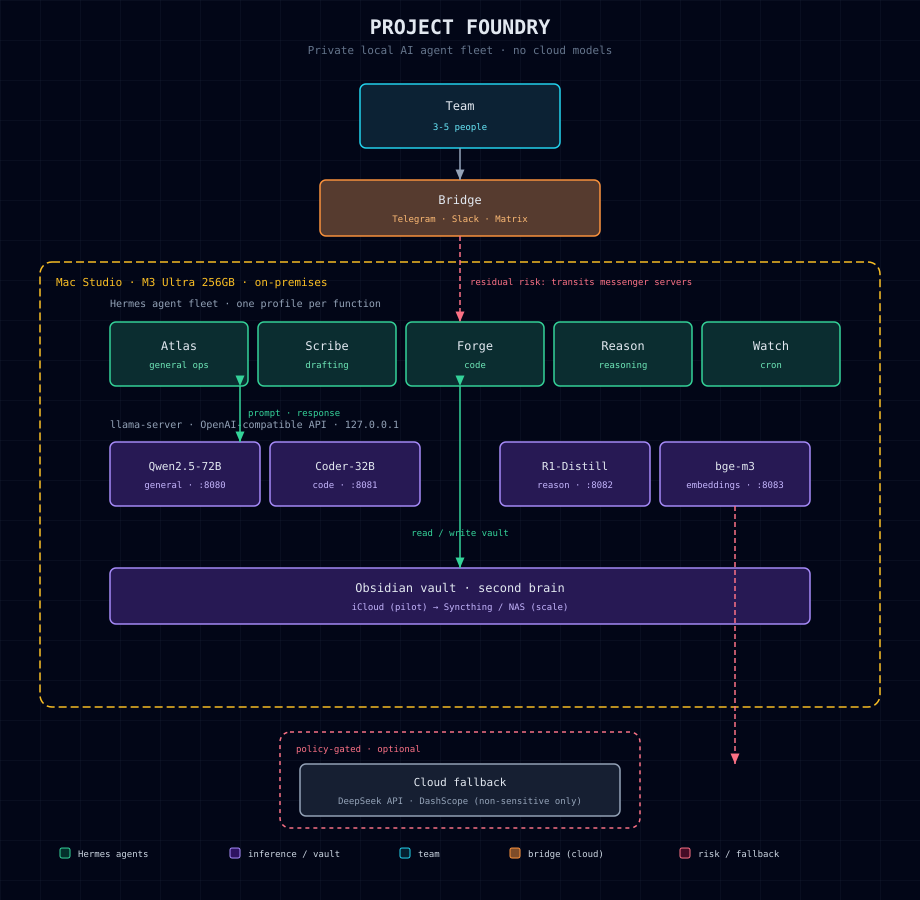

# Project Foundry

A private, local-first AI agent fleet for a 20-30 person company. No cloud models, no IP leakage. A handful of Mac Studios, a small Hermes agent fleet, and a chat bridge your team already uses.

> **On naming.** "Project Foundry" and "the operator" are code names. This guide is published with the real company, people, and any identifying details removed. The architecture, commands, and sizing are real and field-tested.

---

## The problem

A 20-30 person company runs on laptops, and everyone reaches for a cloud AI assistant for writing, code, and analysis. Every prompt - source snippets, customer notes, internal strategy - is shipped to a third party and used to train their models. For a company whose product *is* its intellectual property, that is an open tap.

## The answer

Run the models on your own hardware, in your own building, and give the team agents through a chat bridge they already know. This is a **fleet**, not a single box: three Mac Studios behind a small router, serving the full team locally.

## Architecture at a glance



Five layers, bottom to top:

1. **Hardware** - a Mac Studio fleet (Apple Silicon, unified memory) plus a router. See `docs/02-hardware.md`.
2. **Inference** - `llama.cpp` `llama-server` exposes local models as an OpenAI-compatible API, co-resident in unified memory.
3. **Agent framework** - [Hermes Agent](https://github.com/NousResearch/hermes-agent) profiles, one per function. Each is an independent agent with its own model, memory, skills, and bot.
4. **Bridge** - the team talks to agents over Telegram/Slack (or self-hosted Matrix in strict mode).
5. **Files / second brain** - an Obsidian vault synced via Syncthing/NAS is the shared knowledge base.

## Deployment plan

Two phases. Do not buy the fleet before the pilot proves the concept.

| Phase | Headcount | Hardware | Goal |
|---|---|---|---|
| **1. Pilot** | 3-5 power users | 1x Studio + 1 Mini | de-risk: prove model quality, workflow, bridge |
| **2. Fleet** | 20-30 (steady load) | 3x Studio + router | the deployment |

The pilot exists to answer the one question that can kill the project: *is the local model good enough that people will actually use it?* Find out for $7k in two weeks before committing ~$22k. See `docs/08-scaling.md`.

## Cost: two ways to build the fleet

For 20-30 people at steady load (peak ~8-12 concurrent), there are two defensible designs:

| | **Tiered** *(recommended)* | **All-70B** |
|---|---|---|
| Mac Studios | 3 | 5 |
| Approx cost (one-time) | ~$22k | ~$36k |
| Heavy work (analysis, strategy, long drafting) | 70B flagship | 70B flagship |
| Routine work (quick answers, triage, code) | 32B | 70B |
| Peak concurrent capacity | ~14-20 | ~18-24 |

**The tradeoff in one line:** all-70B buys flagship quality on *routine* tasks where a 32B is already perfectly good, at ~65% more hardware. Tiered puts the flagship where it matters (heavy work) and a fast, high-concurrency 32B where it doesn't (routine), saving ~$14k. Full cost and capability breakdown in `docs/02-hardware.md`.

## The three decisions that matter

| Decision | Recommendation | Why |
|---|---|---|
| **Model tier** | Tiered (70B + 32B) | flagship for heavy work, 32B for routine - best cost/capability |
| **Bridge** | Telegram/Slack, policy from day one | fast to stand up; Matrix if the IP is hot enough to matter |
| **File sync** | Syncthing/NAS | iCloud does not survive 20-30 people; offboarding and access control do |

Read `docs/01-architecture.md` for the full reasoning, including the **bridge paradox** (the one non-obvious leak most people miss).

## Repo layout

```
docs/
  01-architecture.md      System design + the bridge paradox
  02-hardware.md          Sizing + tiered vs. all-70B cost analysis
  03-models.md            Model selection + quantization
  04-inference-stack.md   llama.cpp / MLX, OpenAI-compatible server
  05-hermes-agents.md     Hermes fleet: profiles, gateways, bridge
  06-deepseek-harness.md  Parallel DeepSeek reasoning tier
  07-bridge-and-files.md  Telegram/Slack/Matrix + Obsidian sync
  08-scaling.md           Deployment plan: pilot → fleet
  09-security.md          Threat model + hardening + data policy
assets/
  architecture.svg        System diagram
scripts/
  download-models.sh      Pull the model set
  healthcheck.sh          Verify the stack is up
```

## Quick start (pilot, ~a weekend)

1. Buy and unbox a Mac Studio - `docs/02-hardware.md`.
2. Install the inference stack and pull the models - `docs/04-inference-stack.md`, `scripts/download-models.sh`.
3. Install Hermes and create the agent fleet - `docs/05-hermes-agents.md`.
4. Wire the DeepSeek reasoning tier - `docs/06-deepseek-harness.md`.
5. Connect the team's bridge and the shared vault - `docs/07-bridge-and-files.md`.
6. Run `scripts/healthcheck.sh`, then grow to the fleet - `docs/08-scaling.md`.

## Scaling is additive, not a rewrite

The pilot is a single box. Going to 20-30 (or beyond) means adding boxes and a router, then pointing agent profiles at them. Nothing in the software stack changes. See `docs/08-scaling.md`.

## License

MIT. Use it, fork it, build your own fleet. Attribution appreciated.
